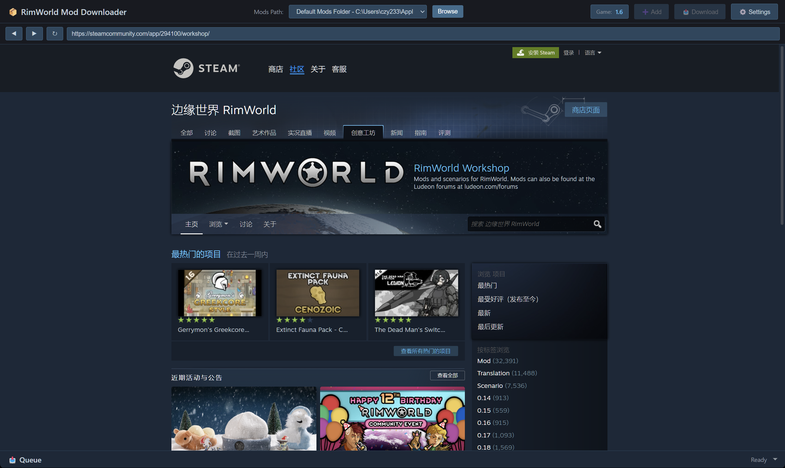
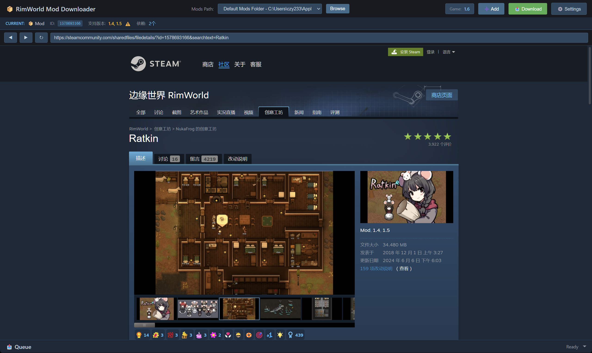
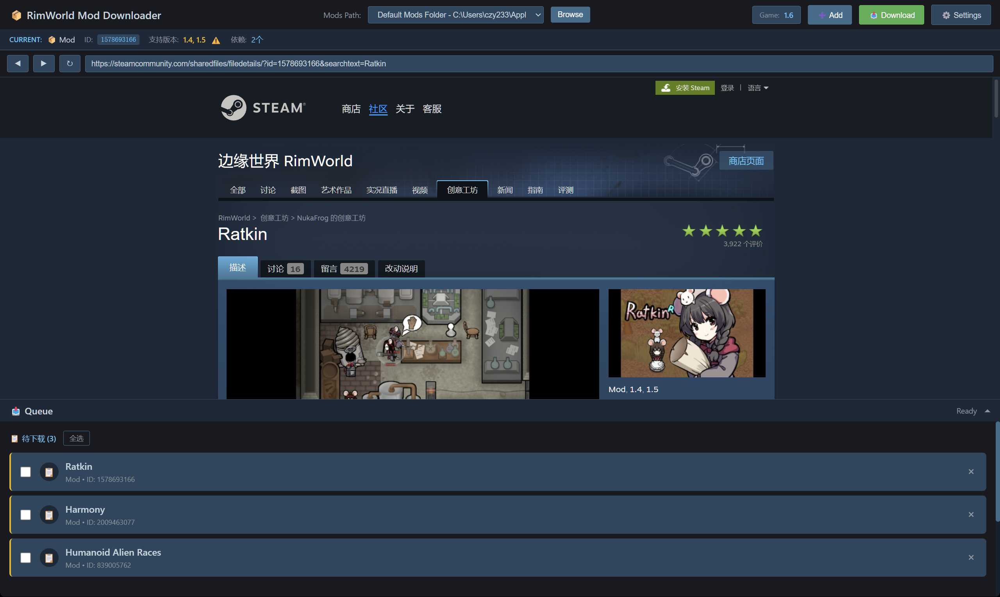
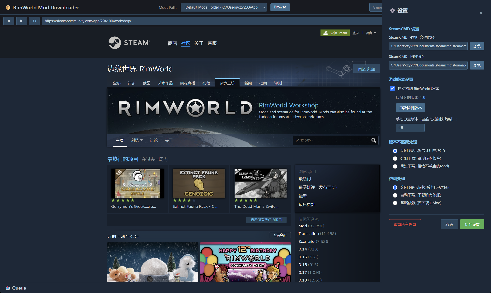

# RimWorld Mod Downloader

一个用于从 Steam Workshop 下载和管理 RimWorld 模组的 Electron 桌面应用程序。

**提醒**:本项目完全使用**Vibe Coding**进行编写，可能会带来不稳定的bug。

## 界面预览

| 主界面 | Mod 详情 |
|--------|----------|
|  |  |

| 下载队列 | 设置面板 |
|----------|----------|
|  |  |

## 功能特性

- 内置 Steam Workshop 浏览器，可直接浏览和下载模组
- 自动检测 RimWorld 游戏版本
- 模组版本兼容性检查
- 自动检测并下载依赖项
- 待下载队列功能，支持批量下载
- 多个模组文件夹路径管理
- 实时下载进度显示
- Steam 风格的用户界面

## 技术栈

| 分类 | 技术 |
|------|------|
| 框架 | Electron 28.1.3 |
| 构建工具 | electron-vite 2.0.0 |
| UI | React 18.2.0 + TypeScript 5.3.3 |
| 样式 | Tailwind CSS 3.4.1 |
| 配置管理 | electron-store 8.1.0 |
| HTTP 请求 | axios 1.13.5 |
| HTML 解析 | cheerio 1.2.0 |

## 安装

### 前置要求

- Windows 10/11
- [SteamCMD](https://developer.valvesoftware.com/wiki/SteamCMD) (用于下载 Steam Workshop 内容)
- RimWorld (可选，用于自动检测版本)

### 从 Release 安装

1. 前往 [Releases](../../releases) 页面
2. 下载最新版本的.zip文件 (`RimWorld-Mod-Downloade-x.x.x.zip`)
3. 运行`RimWorld Mod Downloader.exe`

### 从源码构建

```bash
# 克隆仓库
git clone https://github.com/czyczy23/Rimworld_Mod_Downloader.git
cd Rimworld_Mod_Downloader

# 安装依赖
npm install

# 开发模式运行
npm run dev

# 类型检查
npm run typecheck

# 构建
npm run build

# 打包 Windows 版本
npm run build:win
```

## 使用说明

### 首次启动向导

首次启动时会自动显示欢迎向导，引导您完成基础配置：

#### 步骤 1: 欢迎使用
- 了解应用的主要功能特性

#### 步骤 2: 配置 SteamCMD
- 选择 `steamcmd.exe` 的位置
- 如果没有安装 SteamCMD，请先[下载安装](https://developer.valvesoftware.com/wiki/SteamCMD)

#### 步骤 3: 配置下载路径
- 系统会根据 SteamCMD 位置**自动推导**下载路径
- 格式：`steamcmd根目录\steamapps\workshop\content\294100`
- `294100` 是 RimWorld 的 Steam AppID
- **程序会自动创建该目录**，无需手动创建

#### 步骤 4: 配置 Mods 文件夹
- **使用默认路径**：自动添加 RimWorld 默认 Mods 文件夹
- **自定义路径**：手动选择其他位置作为 Mods 文件夹
- 支持添加**多个路径**，点击 ★ 设置默认路径

#### 步骤 5: 完成
- 查看配置摘要，确认无误后点击"开始使用"

### 管理 Mods 路径

在正常使用中，您可以随时管理 Mods 路径：

#### 方式 1: 工具栏快速切换
1. 点击工具栏中的 **Mods Path** 下拉框
2. 选择已添加的路径，或点击 **Browse** 添加新路径

#### 方式 2: 设置面板完整管理
1. 点击右上角的 ⚙️ **设置** 按钮
2. 找到 **📁 Mods 文件夹管理** 区域
3. 您可以进行以下操作：
   - **★/☆ 点击星标**：设置默认路径（下载时默认使用此路径）
   - **✎ 编辑**：点击编辑按钮修改路径名称，支持回车保存、ESC 取消
   - **× 删除**：移除不需要的路径
   - **🏠 使用默认路径**：快速添加 RimWorld 默认 Mods 文件夹
   - **📂 自定义路径**：手动选择其他位置
4. 点击 **保存设置** 应用更改

### 下载模组

1. 在应用内的浏览器中导航到 Steam Workshop 模组页面
2. 应用会自动检测模组信息：
   - 模组 ID
   - 支持的游戏版本
   - 依赖项数量
3. 点击 "Download" 立即下载，或点击 "Add" 添加到待下载队列
4. 如果有依赖项，会提示是否一并下载
5. 如果模组版本不兼容，会显示警告

### 待下载队列

1. 浏览多个模组页面，点击 "Add" 将它们添加到队列
2. 点击下载队列区域查看所有待下载的模组
3. 可以选择不需要的模组并删除
4. 点击 "Download All" 开始批量下载

### 配置选项

| 选项 | 说明 |
|------|------|
| SteamCMD Executable Path | SteamCMD 可执行文件路径 |
| SteamCMD Download Path | SteamCMD 下载临时目录 |
| Mods Paths | RimWorld 模组文件夹列表 |
| Auto Detect Game Version | 自动从 RimWorld 安装目录检测版本 |
| Skip Version Check | 跳过模组版本兼容性检查 |
| On Version Mismatch | 版本不匹配时的行为：询问/强制下载/跳过 |
| Dependency Mode | 依赖项处理方式：询问/自动下载/忽略 |

## 项目结构

```
src/
├── main/                    # 主进程 (Node.js)
│   ├── index.ts            # 窗口创建、应用入口
│   ├── ipcHandlers.ts      # IPC 路由注册
│   ├── services/
│   │   ├── SteamCMD.ts     # SteamCMD 进程包装器
│   │   ├── ModProcessor.ts # 文件操作 + About.xml 验证
│   │   └── WorkshopScraper.ts # Steam 网页抓取
│   └── utils/
│       └── ConfigManager.ts # 配置管理
├── preload/
│   └── index.ts             # ContextBridge API 定义
├── renderer/                # 渲染进程 (React)
│   └── src/
│       ├── App.tsx          # 主应用
│       └── components/
│           ├── WebviewContainer.tsx    # Steam Workshop 浏览器
│           ├── Toolbar.tsx              # 工具栏
│           ├── DownloadQueue.tsx        # 下载队列
│           ├── SettingsPanel.tsx        # 设置面板
│           ├── DependencyDialog.tsx     # 依赖项选择对话框
│           ├── VersionMismatchDialog.tsx # 版本不匹配警告
│           ├── PendingQueueDialog.tsx   # 待下载队列对话框
│           └── DeleteConfirmDialog.tsx  # 删除确认对话框
└── shared/
    └── types.ts             # 共享类型定义
```

## 故障排除

### 网络环境问题

如果你在使用应用时遇到以下问题：
- Steam Workshop 页面加载失败或空白
- 下载速度为 0 或下载失败
- 提示网络连接错误

**推荐使用 [Watt Toolkit (Steam++)](https://steampp.net/) 加速器**

Watt Toolkit 是免费开源的 Steam 加速工具，可有效解决 Steam 创意工坊访问问题。

**注意**：使用其他加速器（如 UU 加速器、雷神加速器等）时，可能会出现：
- 创意工坊页面无法加载
- 下载速度为 0
- 下载卡在 "Downloading" 状态

这是因为部分加速器仅加速游戏流量，不加速 Steam Web 页面或 SteamCMD。建议遇到此类问题时切换到 **Watt Toolkit**。

### SteamCMD 下载失败

- 确认 `steamcmd.exe` 存在于配置的路径中
- 检查 Windows Defender/杀毒软件是否阻止了 SteamCMD
- 确认有足够的磁盘空间

### 文件移动失败 / 权限错误

- 确认 Mods 文件夹存在且可写
- 检查杀毒软件是否阻止了文件操作
- 确认没有文件被锁定（关闭 RimWorld！）
- **以管理员身份运行程序**（某些系统需要管理员权限才能写入 Mods 文件夹）

### 下载按钮不工作

- 确认你在 Steam Workshop 模组详情页面
- 检查控制台是否有错误信息

### 版本检测不工作

- 确认 Mods 文件夹的父目录是 RimWorld 安装目录
- 确认 `Version.txt` 文件存在

## 开发说明

### 核心架构模式

1. **IPC 通信**：Renderer 通过 `window.api.xxx()` 调用 Main 进程
2. **单例模式**：所有服务都是单例
3. **事件驱动进度更新**：SteamCMD 继承 EventEmitter 发送进度

### 完整下载流程

```
1. 用户在 Webview 中导航到模组详情页
   ↓
2. WebviewContainer 解析 URL，提取 modId
   ↓
3. Toolbar 自动检查模组版本和依赖项
   ↓
4. 用户点击下载按钮
   ↓
5. 检查版本兼容性（根据配置）
   ↓
6. 检查依赖项（根据配置）
   ↓
7. SteamCMD 下载模组
   ↓
8. ModProcessor 处理文件（原子操作）
   ↓
9. 验证 About.xml
   ↓
10. 完成！
```

## 许可证

MIT License

## 贡献

欢迎提交 Issue 和 Pull Request！

## 免责声明

本工具仅供学习和个人使用。请遵守 Steam 服务条款和 RimWorld 模组许可协议。
